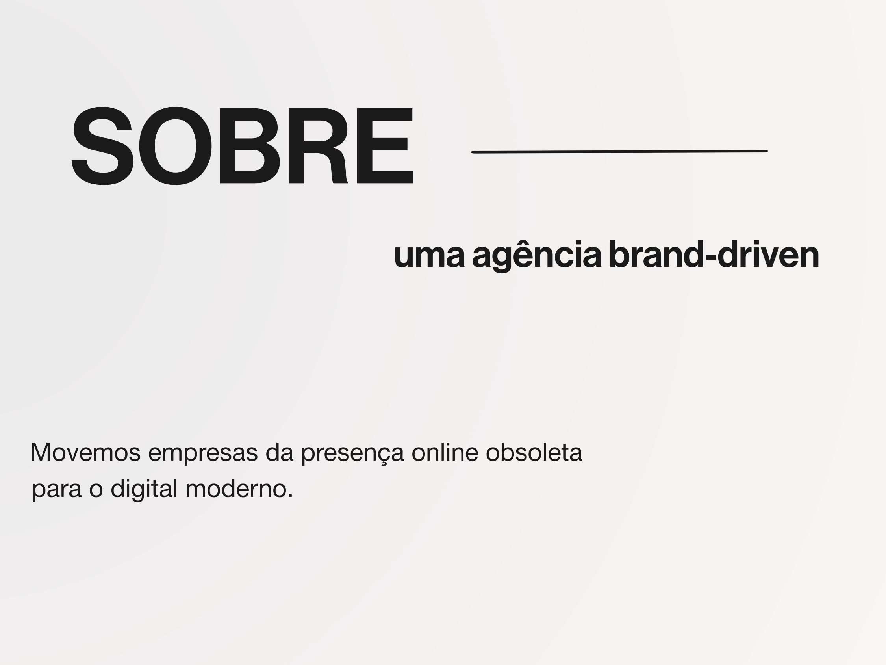
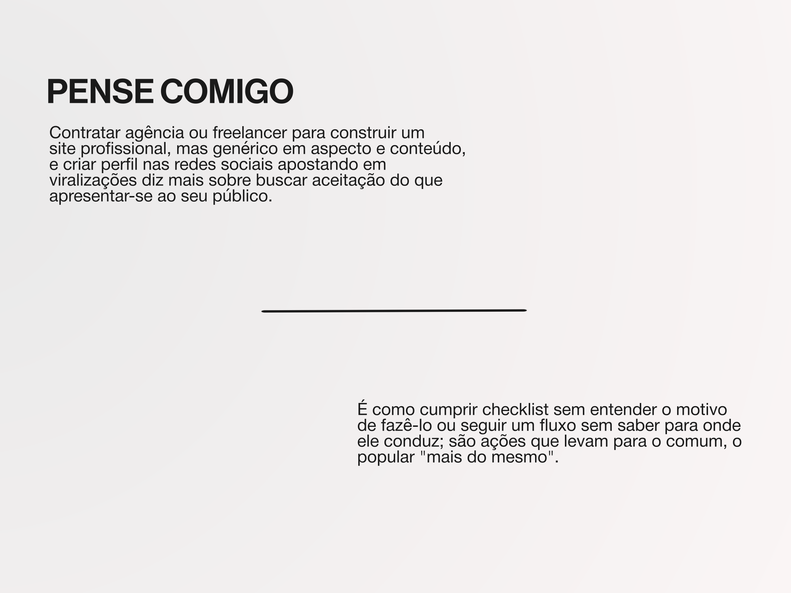
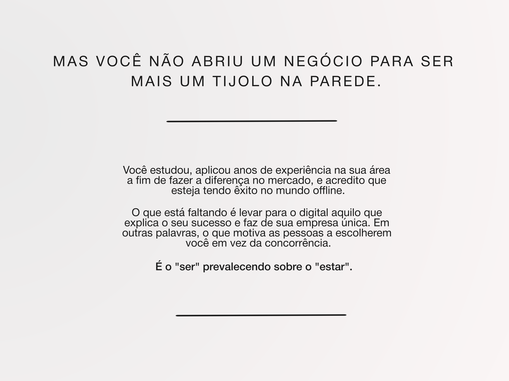
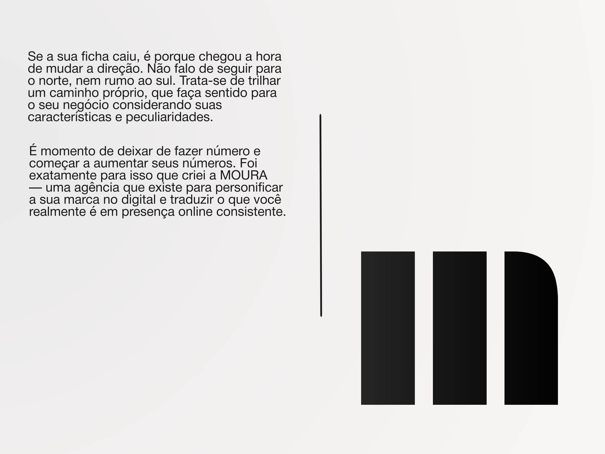
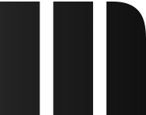
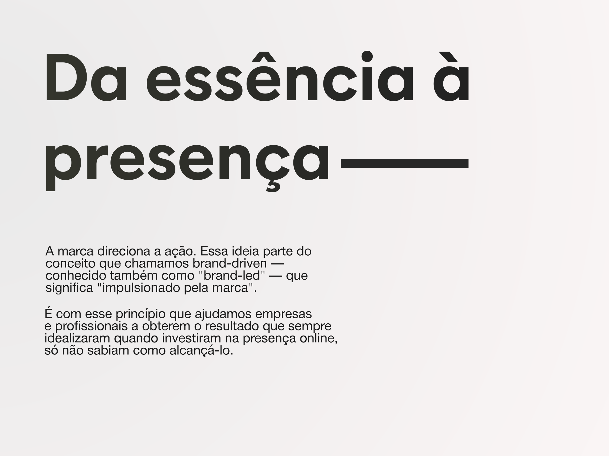
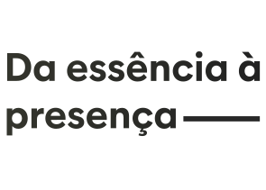
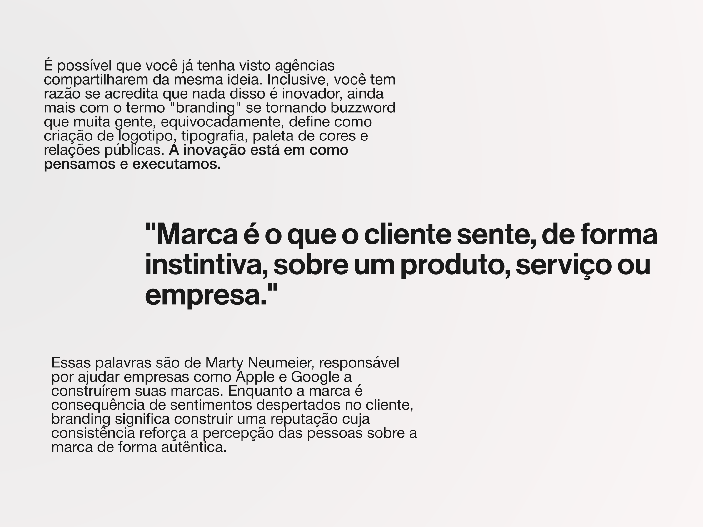
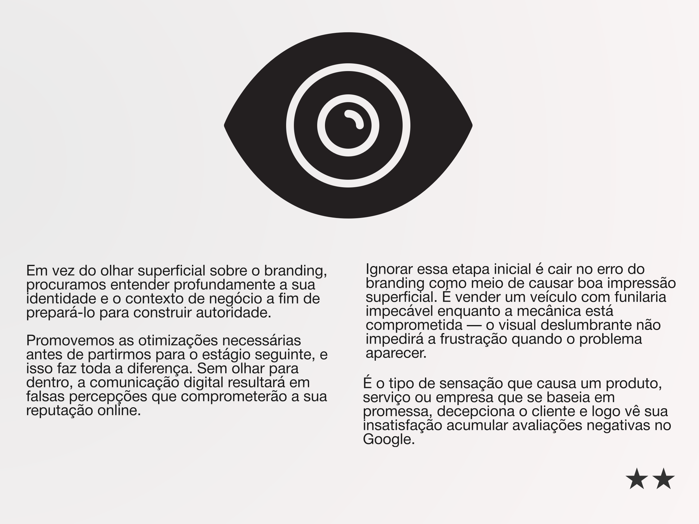
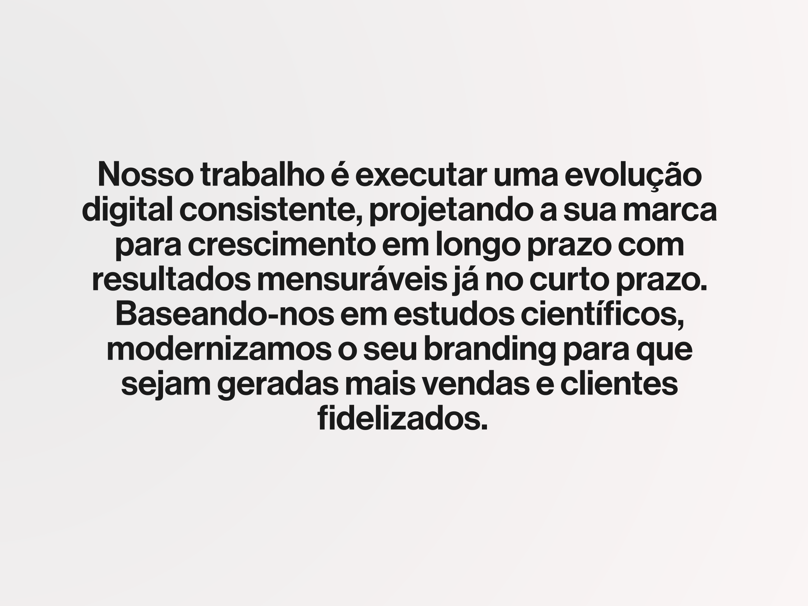

# Instruções para construção da página "Sobre"

Retomaremos a construção da página /sobre — já existente no site com barra de navegação, seção inicial e footer, componentes que não serão alterados nesta tarefa. Leia as instruções a seguir para que o resultado seja uma página visualmente atraente, que ofereça excelente experiência de leitura e layout editorial moderno.

## Orientações gerais

A seção existente não deve ser alterada, nem excluída. O trabalho começará na segunda seção, seguindo os estilos definidos no global.css. Cada parte da instrução contém imagens do projeto a fim de auxiliar na captura do design e da estrutura de cada seção. Também constam detalhes sobre tipografia, artes a serem criadas via CSS e elementos SVG existentes com os respectivos diretórios nos quais se encontram armazenados. Precisamos de máxima fidelidade ao que foi desenhado.

## Parâmetros-base

Visando facilitar a documentação, defini variáveis para os tipos de elementos com os quais trabalharemos frequentemente. Uma regra geral é que o ```background``` de cada seção deve ter valor ```transparent``` por padrão, todas com ```height: 100vh```.

```
Título 1 = title__01
Título 2 = title__02
Subtítulo = subtitle
Corpo de texto = body__txt
Corpo de texto destaque = body__alt
Linhas decorativas horizontais = line__x
Linhas decorativas verticais = line__y
```


```
.title__01 {
    font-family: var(--font-family-heading);
    font-size: var(--font-size-hero);
    font-weight: var(--font-weight-medium);
    text-transformation: uppercase;
}

.title__02 {
    font-family: var(--font-family-heading);
    font-size: var(--font-size-4xl);
    font-weight: var(--font-weight-medium);
    text-transformation: uppercase;
}

.subtitle {
    font-family: var(--font-family-heading);
    font-size: var(--font-size-3xl);
    font-weight: var(--font-weight-medium);
}

.body__txt {
    font-family: var(--font-family-primary);
    font-size: var(--font-size-lg);
    font-weight: var(--font-weight-regular);
}

.body__alt {
    font-family: var(--font-family-primary);
    font-size: var(--font-size-xl);
    font-weight: var(--font-weight-medium);
}

.line__x, .line__y {
    color: var(--color-border);
    height: var(--line-height-tight);
    width: 750px
}
```


## Seção 1



Adicione esta abaixo da seção inicial composta pelo texto `"MOURA"` ocupando a tela inteira, adicione esta seção com base na imagem disponibilizada, acima.

Note que o primeiro elemento é um `.title__01` com a palavra `"SOBRE"` seguido de um `line__x` alinhada verticalmente no centro, em sincronia com o texto.

Abaixo, adicione espaçamento com valor `--space-3xl` e acrescente um `subtitle` com o texto `"uma agência brand-driven"` em `lowercase`.

Em seguida, adicione espaçamento de ```16rem``` e acrescente um `body__alt` com o texto `Movemos empresas da presença online obsoleta para o digital moderno.`.

Fim de seção.


## Seção 2


No início da seção, adicione um `title__01` com o texto: 

> O SER E O ESTAR NA INTERNET.

Acrescente espaçamento `--space-4xl` e então um `body__txt` com o texto:

> A diferença entre ser e estar representa um desafio para as empresas na internet. Em muitos casos — provavelmente a maioria deles — o "estar na web" resume a presença online do negócio. É um pensamento que explica o porquê de tantos sites e perfis de empresas refletirem pouco ou mesmo nada do que elas realmente são, pois a maneira de agir converge para isso.

Fim de seção.


## Seção 3



A seção se inicia com um `title_02` alinhado à esquerda, na parte superior da seção, com o texto `"PENSE COMIGO"` seguido de um `body__txt` com o texto:

> Contratar agência ou freelancer para construir um site profissional, mas genérico em aspecto e conteúdo, e criar perfil nas redes sociais apostando em viralizações diz mais sobre buscar aceitação do que apresentar-se ao seu público.

Bem no centro da página há um `line__x` como se fosse um divider.

Na parte inferior direita da seção há a continuação do texto em `body__txt`:

> É como cumprir checklist sem entender o motivo de fazê-lo ou seguir um fluxo sem saber para onde ele conduz; são ações que levam para o comum, o popular "mais do mesmo".

Fim de seção.


## Seção 4



A seção abre com os conteúdos todos centralizados, começando pelo `body__alt` com `uppercase` cujo texto é:

> Mas você não abriu um negócio para ser como mais um tijolo na parede.

Adicione espaçamento `--space-4xl` seguido de um `line__x` e mais um espaçamento `--space-5xl`.

No centro da página, abaixo desses elementos, teremos os três blocos de texto `body__txt`:

> Você estudou, aplicou anos de experiência na sua área a fim de fazer a diferença no mercado, e acredito que esteja tendo êxito no mundo offline.

> O que está faltando é levar para o digital aquilo que explica o seu sucesso e faz de sua empresa única. Em outras palavras, o que motiva as pessoas a escolherem você em vez da concorrência.

> É o "ser" prevalecendo sobre o "estar".

Adicione outro espaçamento `--space-5xl` e um `line__x`.

Fim de seção.


## Seção 5



A seção começa com dois blocos `body__txt` no canto superior esquerdo com os seguintes parágrafos:

> Se a sua ficha caiu, é porque chegou a hora de mudar a direção. Não falo de seguir para o norte, nem rumo ao sul. Trata-se de trilhar um caminho próprio, que faça sentido para o seu negócio considerando suas características e peculiaridades.

> É momento de deixar de fazer número e começar a aumentar seus números.
Foi exatamente para isso que criei a MOURA — uma agência que existe para personificar a sua marca no digital e traduzir o que você realmente é em presença online consistente.

No centro da página adicione um `line__y`. A linha vertical atuará como divider.

Logo em seguida, no canto inferior direito da seção, adicione o logo no seu tamanho original, disponível em:



Fim de seção.


## Seção 6



Inicie a seção adicionando o SVG, abaixo, com alinhamento `start`, na parte superior da tela, ocupando aproximadamente 40% da página.



Em seguida, acrescente espaçamento `--space-3xl` e os dois blocos de texto:

> A marca direciona a ação. Essa ideia parte do conceito que chamamos brand-driven — conhecido também como "brand-led" — que significa "impulsionado pela marca".

> É com esse princípio que ajudamos empresas e profissionais a obterem o resultado que sempre idealizaram quando investiram na presença online, só não sabiam como alcançá-lo.

Fim de seção.


## Seção 7



Esta seção é composta por três blocos de texto, sendo o primeiro um `body__txt`, o segundo um `subtitle` e o terceiro, um `body__txt`. Adicione espaçamento `--space-3xl` entre cada elemento.

**Atenção:** o elemento `subtitle` deve ser tratado como subtítulo apenas no estilo, mas na prática é um `blockquote` — e é assim que deve ser apresentado no código.

Abaixo, os blocos de texto na respectiva ordem:

> É possível que você já tenha visto agências compartilharem da mesma ideia. Inclusive, você tem razão se acredita que nada disso é inovador, ainda mais com o termo "branding" se tornando buzzword que muita gente, equivocadamente, define como criação de logotipo, tipografia, paleta de cores e relações públicas. A inovação está em como pensamos e executamos.

> "Marca é o que o cliente sente, de forma instintiva, sobre um produto, serviço ou empresa."

> Essas palavras são de Marty Neumeier, responsável por ajudar empresas como Apple e Google a construírem suas marcas. Enquanto a marca é consequência de sentimentos despertados no cliente, branding significa construir uma reputação cuja consistência reforça a percepção das pessoas sobre a marca de forma autêntica.

Fim de seção.


## Seção 8



Adicione no início da seção o SVG, abaixo, que ocupará aproximadamente 40% da página, com posicionamento centralizado.


Após o SVG, teremos quatro blocos de texto `body__txt` dividido em duas colunas `grid` (dois parágrafos em cada coluna do grid) com os seguintes parágrafos:

> Em vez do olhar superficial sobre o branding, procuramos entender profundamente a sua identidade e o contexto de negócio a fim de prepará-lo para construir autoridade.

> Promovemos as otimizações necessárias antes de partirmos para o estágio seguinte, e isso faz toda a diferença. Sem olhar para dentro, a comunicação digital resultará em falsas percepções que comprometerão a sua reputação online.

> Ignorar essa etapa inicial é cair no erro do branding como meio de causar boa impressão superficial. É vender um veículo com funilaria impecável enquanto a mecânica está comprometida — o visual deslumbrante não impedirá a frustração quando o problema aparecer.

> É o tipo de sensação que causa um produto, serviço ou empresa que se baseia em promessa, decepciona o cliente e logo vê sua insatisfação acumular avaliações negativas no Google.

Abaixo do último parágrafo acrescente espaçamento ` --space-2xl` seguido de dois caracteres de estrela `★★`, na cor `var( --color-secondary)`, e tamanho aproximado de `2rem`, com posicionamento `end`.

Fim de seção.


## Seção 9



A seção terá um bloco de texto `body__alt` centralizado na tela e com alinhamento `center` com o texto:

> A MOURA nasceu como oportunidade para negócios de todos os portes e segmentos fazerem diferente. Nosso trabalho é executar uma evolução digital consistente, projetando a sua marca para crescimento em longo prazo com resultados palpáveis já no curto prazo. Baseando-nos em estudos científicos, modernizamos o seu branding para que sejam geradas mais vendas e clientes fidelizados.

Adicione espaçamento `--space-3xl`.

Finalize a seção com o botão `btn-primary` disponível no componente `Button.astro`. A CTA é `Agende uma conversa`.

Garanta um espaço de pelo menos `--space-4xl` entre o botão e o `footer`.

Fim de seção.


## Responsividade

Simplifique a página para dispositivos móveis proporcionando uma experiência estilo e nível Kindle, priorizando o fator `readability`. Se necessário, isole os SVGs para que não atrapalhem a renderização dos blocos de texto.